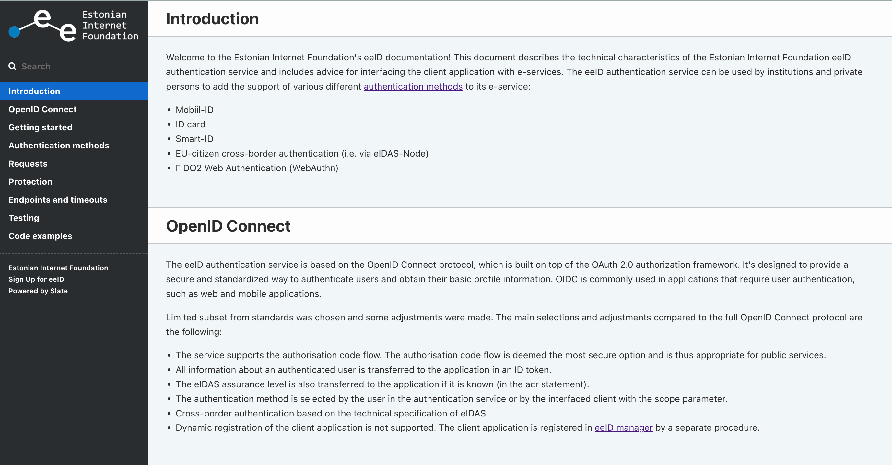

  

eeID documentation

<em>View the documentation at <a href="https://internetee.github.io/eeID-DOC">internetee.github.io/eeID-DOC</a>.</em>

<a href="https://github.com/slatedocs/slate/wiki/Using-Slate-in-Docker">Using in Docker</a>

